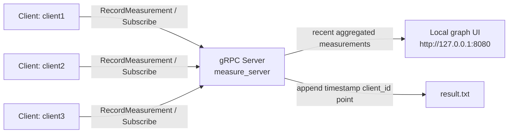

# Measure

`Measure` is a small gRPC-based measurement system:
- one server accepts measurements from multiple clients
- each client can subscribe to server-pushed threshold commands
- the server exposes a localhost-only graph page that shows recent measurements
- each client is drawn in a different colour on the graph

## Overview

Clients generate measurements and send values above the active threshold to the
server. The server stores a bounded in-memory history of recent measurements,
appends them to `result.txt`, and serves a simple graph UI on localhost.

## Architecture



## Build

### Option 1: use installed protobuf and gRPC

Run `protoc`:
```bash
protoc -I . --grpc_out=. --plugin=protoc-gen-grpc=`which grpc_cpp_plugin` ./measure.proto
protoc -I . --cpp_out=. ./measure.proto
```

Build using `cmake`:
```bash
mkdir -p cmake/build
pushd cmake/build
cmake -DCMAKE_PREFIX_PATH=$MY_INSTALL_DIR ../..
make -j 4
```

### Option 2: let CMake fetch protobuf and gRPC

If protobuf and gRPC are not already installed locally:
```bash
mkdir -p cmake/build
pushd cmake/build
cmake -DGRPC_FETCHCONTENT=ON ../..
make -j 4
```

## Run

Start the server:
```bash
./measure_server --port=50051 --http_port=8080 --samples_retained=500
```

Start one or more clients with different IDs:
```bash
./measure_client --target=localhost:50051 --client_id=client1
./measure_client --target=localhost:50051 --client_id=client2
```

Open the graph page:
```text
http://127.0.0.1:8080/
```

## What the graph shows

- one combined graph for all connected clients
- one colour per client
- recent measurements only, bounded by `--samples_retained`
- periodic refresh every 2 seconds

The graph data comes from the server endpoint:
```text
http://127.0.0.1:8080/measurements.json
```

## Data and behavior notes

- The graph UI is only exposed on localhost.
- Each recorded measurement includes:
  - `point`
  - `client_id`
  - `timestamp_unix_ms`
- The server keeps a bounded in-memory history for the graph.
- The server also appends measurements to `result.txt` as:
  - `timestamp client_id point`
- Clients subscribe to threshold updates from the server using gRPC streaming.
