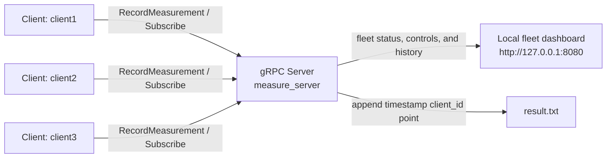

# Measure

`Measure` is a small gRPC-based measurement system:
- one server accepts measurements from multiple clients
- each client can subscribe to server-pushed threshold commands
- the server exposes a localhost-only fleet dashboard for device status,
  threshold configuration, calibration, measurement charts, and recent events
- dashboard panels can be rearranged with drag and drop

## Overview

Clients generate measurements and, in the current sample client, send values
above the active threshold to the server. The server stores every received
measurement in a bounded in-memory history, appends it to `result.txt`, and
serves an operator dashboard on localhost.

## Architecture



## Build

### Option 1: use installed protobuf and gRPC

```bash
cmake -S . -B build -DCMAKE_PREFIX_PATH="$MY_INSTALL_DIR"
cmake --build build --parallel 4
```

### Option 2: let CMake fetch protobuf and gRPC

If protobuf and gRPC are not already installed locally:
```bash
cmake -S . -B build -DGRPC_FETCHCONTENT=ON
cmake --build build --parallel 4
```

CMake generates the protobuf and gRPC sources as part of the build.

## Tests

Catch2 v3 unit and gRPC integration tests are available through CTest. The
integration tests verify that subscribers receive threshold and calibration
commands and that measurement RPCs acknowledge and store measurements. Enable
tests when configuring:
```bash
cmake -S . -B build -DBUILD_TESTING=ON
cmake --build build --parallel 4
ctest --test-dir build --output-on-failure
```

## Run

Start the server:
```bash
./build/measure_server --port=50051 --http_port=8080 --samples_retained=500
```

Start one or more clients with different IDs:
```bash
./build/measure_client --target=localhost:50051 --client_id=client1
./build/measure_client --target=localhost:50051 --client_id=client2
```

Open the fleet dashboard:
```text
http://127.0.0.1:8080/
```

## Dashboard

The dashboard provides:

- connected/offline device status, latest reading, and last-seen time
- fleet-wide threshold updates pushed to subscribed clients
- calibration for all connected clients or one selected device
- recent measurement chart and event history
- draggable dashboard panels; their order is saved in the browser

The dashboard and its control endpoints are bound to localhost only. Mutating
requests require a same-origin request from the dashboard.

The dashboard data is available from:

```text
GET  http://127.0.0.1:8080/api/dashboard
POST http://127.0.0.1:8080/api/threshold
POST http://127.0.0.1:8080/api/calibration
```

Threshold and calibration requests use URL-encoded form fields. For example,
from the dashboard origin:

```text
threshold=5
client_id=client1&duration_seconds=10
```

## Data and behavior notes

- The dashboard is only exposed on localhost.
- Each recorded measurement includes:
  - `point`
  - `client_id`
  - `timestamp_unix_ms`
- The server keeps a bounded in-memory history for the dashboard and event list.
- The server also appends measurements to `result.txt` as:
  - `timestamp client_id point`
- Clients subscribe to threshold updates from the server using gRPC streaming.
- The threshold is shared by all clients; calibration can target one connected
  client or all clients.
